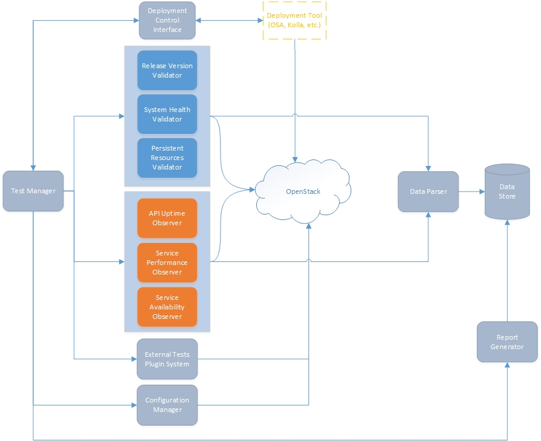

..
 This work is licensed under a Creative Commons Attribution 3.0 Unported
 License.
 http://creativecommons.org/licenses/by/3.0/legalcode

..

===============================
 OpenStack Upgrade Test Toolset
===============================

As the OpenStack community works to improve the upgrade experience, there is a
growing need to provide a variety of test tools which help to exercise,
harness and validate the upgrade approaches defined by the community.
This spec describes the creation of a new toolset that could be used to test
upgrades of OpenStack services.

Problem Description
===================

OpenStack projects represent code that is installed and deployed on many
distributed systems in order to provide services to users. Operators need to
know which projects support a rolling upgrade process to avoid significant
downtime, which projects support an upgrade process that eliminates downtime of
the control plane entirely, and finally which projects support a seamless
upgrade process that does not impact the performance of the cloud. To this end,
the OpenStack TC defined tags that reflect the maturity of projects in terms of
their upgradeability, these tags are:

- `supports-rolling-upgrade`_
- `supports-zero-downtime-upgrade`_
- `supports-zero-impact-upgrade`_

Currently there is only one project in the OpenStack ecosystem that can be used
to perform some level of upgrade testing, this project is `Grenade`_, and it was
designed with the main purpose of testing backward compatibility of project
configuration, so it does not provide tests or tools for validating the
different maturity levels of an upgrade. In order for projects to self assess
their upgrade maturity level there is the need for such tests and tools.

As a first strategy to try to fill this gap there was a proposal for adding more
tests and capabilities to Grenade, but the general feeling in the community was
that Grenade was already pushing its limits and it was preferable to fill this
gap with a new tool or set of tools.

Proposed change
===============

This spec proposes a new toolset for testing an OpenStack environment before,
during, and after an upgrade process. The toolset answers the question "how does
OpenStack behave across upgrades from one release N to a release N+1, or from
the latest official release to master?". It also provides information that can
be used to assess if an upgrade complies with the requirements for being
recognized as a `rolling upgrade`_, a `zero downtime upgrade`_ or a
`zero impact upgrade`_.

The toolset will provide the necessary tools for testing the behavior of an
upgrade but will not orchestrate the upgrade process itself initially, this
responsibility will belong to the deployer, making this tool agnostic to the
deployment tool being used. In a future stage, outside the scope of this Spec,
the toolset will include a module to orchestrate the deployment and upgrade
process of OpenStack. This will become clearer after reading the
`use cases`_ below.

To provide all the different tests an upgrade requires, the toolset could
leverage from existing projects, like Tempest or Rally, to perform certain
actions when make sense. As an example, one of the modules the toolset will have
is called *System Health Validator*, this module will be responsible to validate
an OpenStack environment is healthy at certain key points in time (like before
and after running an upgrade), to accomplish this, the toolset could call a
subset of the Tempest tests (e.g. the "smoke" tests) instead of having to
implement these tests from scratch. A second example is the
*Service Performance Observer* which is responsible to validate there is no
service performance degradation after an upgrade, again, instead of implementing
this from scratch the toolset may use Rally to accomplish this task.

This toolset will be able to be used in CI systems as well as in a computer
locally, so developers will be able to leverage it in a development environment.

Use Cases
---------

There are three main use cases for the toolset:

- In the first use case, the toolset has no control over the deployment/upgrade
  process and no control of the test process. A consumer, someone like an
  OpenStack developer, or a downstream project (OpenStack Ansible, Kolla, etc.),
  use tools at will from the toolset to perform validations on a cloud. They can
  choose to run as many tools from the toolset as they want and in whatever
  order they want. In this use case, the toolset is not the one controlling the
  process, so it is unaware of the upgrade process. Therefore if used this way
  to test upgrades, the consumer would be responsible for deploying the
  environment, running the validators and observers in the correct place in the
  upgrade process, performing the upgrade, and stopping the observers once the
  upgrade finishes.

- The second use case is about the toolset having partial control over the
  deployment/upgrade process but full control of the test process. In this use
  case, the toolset uses an interface and a driver to communicate with the
  orchestrator (in this case a deployment tool like OpenStack Ansible, Kolla,
  etc.). When testing an upgrade this way, the toolset will be responsible for
  running the deployment/upgrade process by signaling the orchestrator to
  perform these actions, and will also be responsible for running the validators
  and observers in the appropriate place during the upgrade process. However it
  is important to note that in this use case the toolset signals the
  orchestrator to perform actions in the OpenStack environment but has no
  control whatsoever in how things are done by the orchestrator, so the
  orchestrator is responsible for the upgrade process itself.

- The third use case (**Not in scope for this Spec**) is about having full
  control over the deployment/upgrade process and full control of the test
  process. This use case is very similar to the second one where the toolset
  signals the orchestrator to initiate a deployment/upgrade, but the one big
  difference is that in this case the orchestration module is also owned by the
  toolset, giving it full control of the process. At this point, the toolset
  could effectively replace Grenade since it would be able to perform the same
  validations Grenade does plus much more.

Requirements
------------

**Functional**

1. The tool must be agnostic to the OpenStack environment and to the deployment
   tool used, performing actions consistently across different environments
2. It must validate that services are actually at the correct release version at
   any given time
3. It must validate that all services are functional at any given time (e.g.
   before, during and after an upgrade)
4. It must provide a way of creating and validating persistent resources, like
   VMs or volumes, at any given time
5. It must be capable of measuring if there is API downtime during a specified
   period of time for any of the `supported services`_ listed below
6. It must be capable to detect if all of the `supported services`_ listed below
   are fully available continuously during a specified period of time
7. It must have a centralized store for logs of tests and data collected
8. It must attempt to clean up after itself, if resources were created for
   testing or monitoring purposes they must be removed after they are no longer
   needed
9. It must be pluggable in services meaning that when new services are ready to
   implement an upgrade strategy (for example zero downtime or zero impact),
   they can be easily added to the scope of the tool
10. It must provide a common public interface that others can use to consume the
    toolset
11. It must provide a common public interface that the toolset can use to
    communicate with deployment tools so certain steps of the deployment or the
    upgrade can be triggered
12. For those tests that run continuously during an upgrade, in the case of
    running into a series of errors, the tool must stop these tests, to avoid an
    even more unstable environment, attempt to clean up test resources that may
    have been created and report back
13. It must run tests using non-admin OpenStack user(s) regardless of if the
    tests being run are part of a different tool like Tempest, or new tests
    implemented in the toolset
14. It should be capable of measuring the performance of the
    `supported services`_ listed below during a specified period of time so the
    toolset can provide information that can lead to determine if there was
    degradation of service performance
15. It should auto discover cloud services and configure the tool accordingly
16. It should verify that all requests made during an upgrade are honored at
    some point successfully, validating that they are not just added to a queue
    but are actually processed
17. It should provide the capability to add tests via a plugin system
18. It should use existing test discovery and plugin mechanisms to allow maximum
    reuse of test resources from existing OpenStack test tools
19. It should be capable of performing tests on one of the `supported services`_
    at a time
20. It could include a way of displaying results so they can be easily
    interpreted and could include trends
21. It could be capable of verifying if the data plane is accessible during a
    specified period of time

**Non-Functional**

22. Must be python 3 compatible
23. Must be compatible with Linux environments

Supported Services
------------------

- Identity (Keystone)
- Compute (Nova)
- Object Storage (Swift)
- Block Storage (Cinder)
- Image (Glance)
- Networking (Neutron) *when available*

Projects
========

- New project: (Name TBD)

Implementation
==============

Assignee(s)
-----------

- castulo
- luzC
- hockeynut
- jlwhite
- kvcobb
- dankolbrs
- scarab\_

Work Items
----------

At least the following modules will need to be implemented.

Control Modules:
 - Data store
 - Test manager
 - External tests plugin system
 - Deployment control interface
 - Report generator
 - Data parser
 - Configuration manager

OpenStack Validator Modules:
- Release version validator
- System health validator
- Persistent resources validator

OpenStack Observer Modules:
- API uptime observer
- Service availability observer
- Service performance observer

Milestones
----------

The construction of this toolset is a large effort, we will be building it
incrementally during more than one cycle.

Depending on the type of upgrade to be tested, not all the modules from the
toolset may be needed. For example, to be able to test a `rolling upgrade`_, all
the `OpenStack validator modules`_ are required, but none of the
`OpenStack observer modules`_ are. For a `zero downtime upgrade`_, all modules
from the `OpenStack validator modules`_ are required and it also requires some
of the `OpenStack observer modules`_, like the *API uptime observer* and the
*service availability observer*. Finally, to test `zero impact upgrade`_, all
of the `OpenStack validator modules`_ are required and all of the
`OpenStack validator modules`_ are required as well.

The milestones for Pike will focus in implementing those modules required for a
rolling upgrade which means implementing all of the
`OpenStack validator modules`_ and only the necessary `control modules`_.

This list contains the target modules to be implemented during pike:

- Test Manager
- Deployment Control Interface
- Data Parser
- System Health Validator
- Persistent Resources Validator
- Release Version Validator
- Report Generator (very basic version)

Target milestone for completion:
  Pike-3

Diagram
-------

The following image shows a simplified diagram of the architecture of the
toolset, it does not include all of the interactions between modules.

References
==========

Previous Specs for Grenade related to this effort

- `Ensure API uptime during zero downtime upgrades`_
- `Enable running Rolling Upgrade process`_
- `Make Grenade capable of deploying a multi-node environment`_

.. _supports-rolling-upgrade: https://governance.openstack.org/tc/reference/tags/assert_supports-rolling-upgrade.html
.. _supports-zero-downtime-upgrade: https://governance.openstack.org/tc/reference/tags/assert_supports-zero-downtime-upgrade.html
.. _supports-zero-impact-upgrade: https://governance.openstack.org/tc/reference/tags/assert_supports-zero-impact-upgrade.html
.. _rolling upgrade: https://governance.openstack.org/tc/reference/tags/assert_supports-rolling-upgrade.html
.. _zero downtime upgrade: https://governance.openstack.org/tc/reference/tags/assert_supports-zero-downtime-upgrade.html
.. _zero impact upgrade: https://governance.openstack.org/tc/reference/tags/assert_supports-zero-impact-upgrade.html
.. _Grenade: https://github.com/openstack-dev/grenade
.. _Ensure API uptime during zero downtime upgrades: https://review.openstack.org/#/c/422170/7/specs/grenade/api-uptime.rst
.. _Enable running Rolling Upgrade process: https://review.openstack.org/#/c/433216/3/specs/grenade/rolling_upgrade.rst
.. _Make Grenade capable of deploying a multi-node environment: https://review.openstack.org/#/c/435636/2/specs/grenade/multi-node-aware.rst
